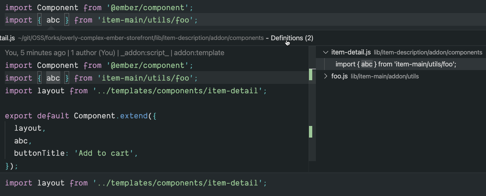

# els-addon-import-specifiers



### An ELS addon that allows jumping to the import specifiers directly

For example:

```js
import { getFooData } from 'bar/utils/blah/foo'
```
On clicking on `getFooData`, you will be able to jump to the actual line of `foo.js` where `getFooData` is exported.

